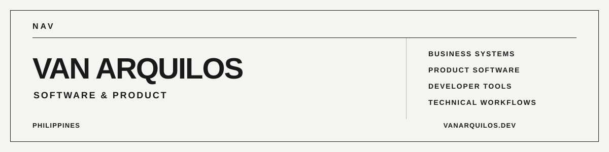

<picture>
  <source media="(prefers-color-scheme: dark)" srcset="./assets/github-profile-dark.svg">
  <source media="(prefers-color-scheme: light)" srcset="./assets/github-profile-light.svg">
  
</picture>

BS Computer Science student at Our Lady of Fatima University in the Philippines, building business systems, product software, developer tools, and practical technical workflows.

[Portfolio](https://vanarquilos.dev)  
[Work](https://vanarquilos.dev/work/)  
[Resume](https://vanarquilos.dev/resume/)  
[Contact](https://vanarquilos.dev/contact/)

## Current

### AYOS Technologies

**Co-Founder, Software & Product**

Building business technology around real operational problems. My work spans product direction, software engineering, business systems, implementation, integration, QA, and technical decision-making.

### Admino

**Founder & Developer**

Building a local-first, account-free life-admin product focused on practical everyday workflows, privacy, and device-native utility.

### Developer Tools

**FileNest and ARQ Tools**

Building focused tooling for mobile file workflows, reusable product infrastructure, documentation, package QA, and practical engineering utilities.

## Selected Engineering

### Personal Skin Manager

Windows desktop tooling for League of Legends skin and mod workflows, including packaged releases, update infrastructure, diagnostics, maintenance tooling, provenance, and release QA.

[Public release repository](https://github.com/vanarquilos/PersonalSkinManager-Updates)

### Portfolio

Astro-based portfolio and case-study system covering responsive engineering, accessibility, production validation, secure Contact delivery, deployment hardening, SEO, security, and release QA.

[vanarquilos.dev](https://vanarquilos.dev)

### FileNest

Expo and React Native tooling for local file picking, normalization, validation, storage, sharing, and reusable mobile file workflows.

Some current company and product repositories are private. Detailed project context and case studies are available on the [Work](https://vanarquilos.dev/work/) page.

## Stack

**Primary**  
TypeScript, React Native, Expo, Astro, React, Node.js, Python, SQLite

**Engineering**  
Product engineering, business systems, QA, release engineering, documentation, deployment, security, and technical diagnostics

## Working Principles

Build around the actual problem and workflow.

Keep claims proportional to proof.

Build systems that remain understandable, testable, and maintainable after shipping.

## Background

BS Computer Science student at Our Lady of Fatima University, expected 2028.

My background spans software and product development, computer and mobile repair, technical diagnostics, troubleshooting, QA, and developer tooling.

I also competed with OLFU QC Phoenix in collegiate League of Legends championship events.
